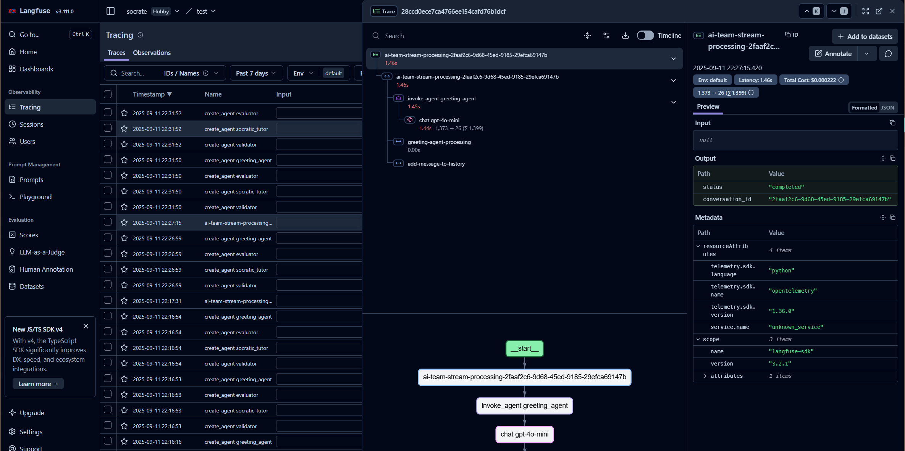
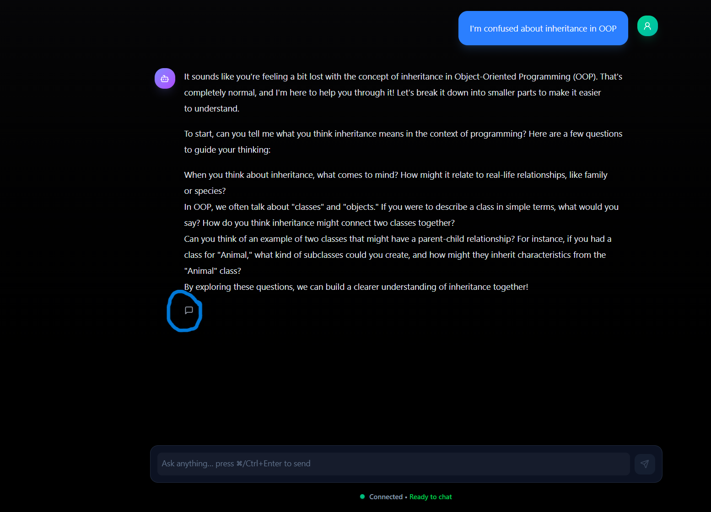
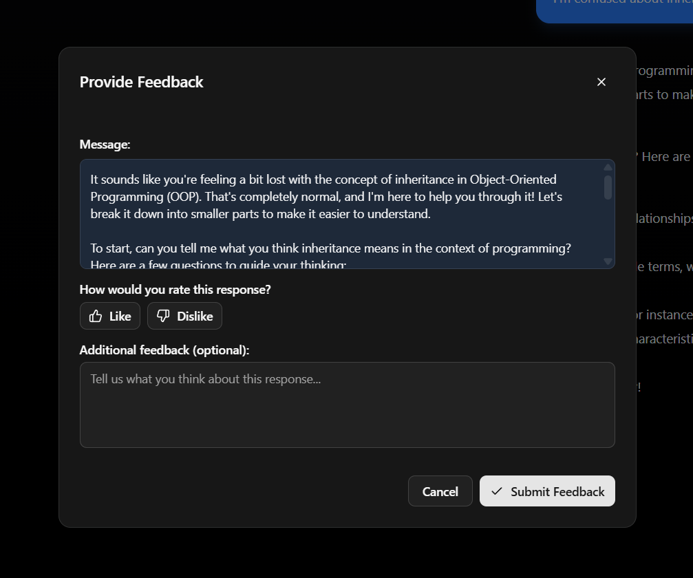
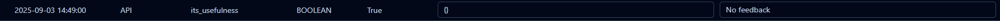
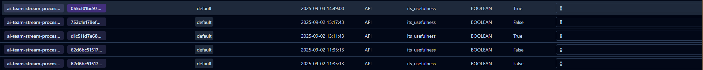
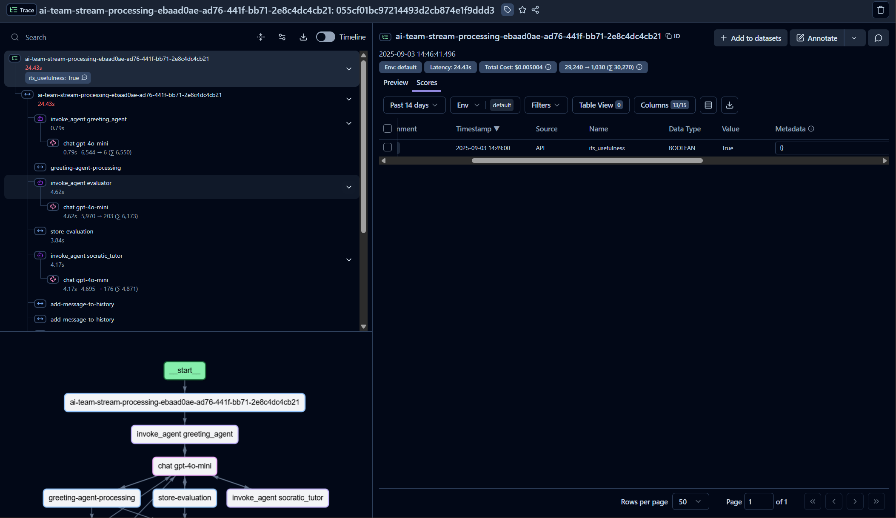

# AI Monitoring and Observability

!!! warning "Warning"
    This should be done after you have already deployed the application to your own server.

To ensure our application's stability and performance (especially AI service) and catch any bugs occurred, in this guide we will help you set up services that monitors our application.

## Langfuse for AI monitoring
We used Langfuse, a cloud-based tracing and observability service that helps us see how our AI system interacts with user and its internal state.

By the end of this section, you should be able to:
- Setup Langfuse for tracing and observability
- View, analyze and intepret how our AI works and its performance via Langfuse.
- See the feedback from user via Langfuse.

We will often refers to [langfuse official documentation](https://langfuse.com/docs) to explain how to use the platform as well as setup it in the application.

### Setup Langfuse

- Create an account on [Langfuse](https://langfuse.com/)
- Create a new project on Langfuse
- Get the public and secret key for the project
- Setup those keys in environment variables. See [environment variables](../development/environment.md), langfuse part for more details.

Afterward, you should try to [chat with our AI](../tutorial/chatting.md) and the traces in Langfuse should be visible.

### View the inner state of AI.
Our application only shows the final response from AI, thus if you are going to debug or monitor how the agent within the AI works, you will need to view the inner state of AI.

- [Access the trace from Langfuse](https://langfuse.com/docs/observability/overview) and click on the trace you want to view.

Chat with our AI application first, then once it is done, you should be able to see the trace in Langfuse. Our trace when captured should look like this:

### See the feedback from user
Our application only shows the final response from AI. Thus if you are going to debug or monitor how the agent within the AI works, you will need to view the inner state of AI.

On our application, when message from AI system is delivered, you should see the feedback button like this:

After clicking on it, a feedback modal with like, dislike and additional comment field will be shown:

User can select if they like the response or not, and also add additional comment if they want to. Upon completing the feedback, it will be sent to Langfuse in normal curcumstance and you should be able to see the feedback in Langfuse in the Scores section. Our feedback when displayed on Langfuse should look like this:

You can also view this information along with the trace that user feedback on by clicking on the Trace name within the Scores section:

