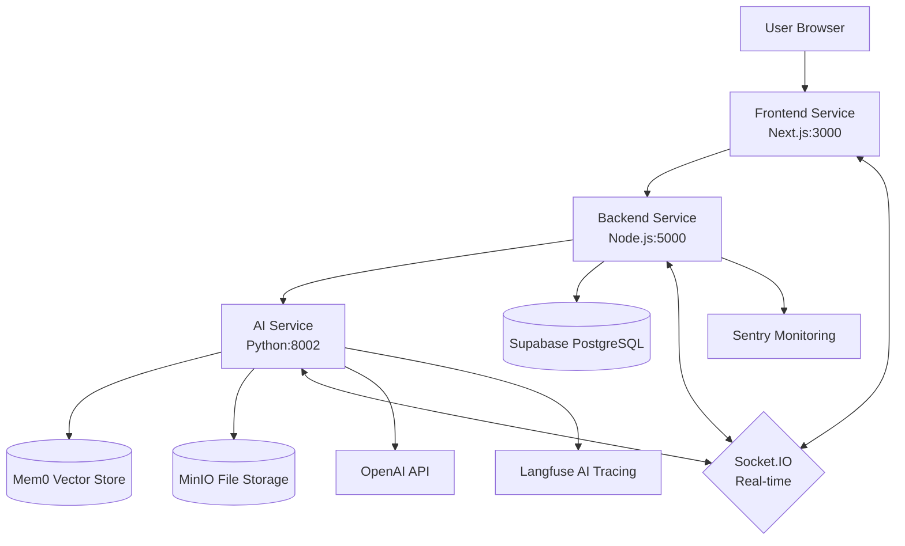
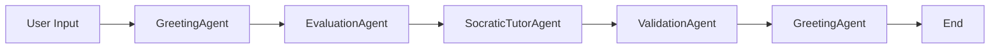

# SocratesCode System Architecture

## Application Overview

SocratesCode is an AI Tutoring application that uses the Socratic method to teach programming. The system is built with a microservices architecture consisting of 3 main services: AI Service (Python/FastAPI), Backend Service (Node.js/Express), and Frontend Service (Next.js/React).

### Technology Stack
- **Frontend**: Next.js 15.3.1 with React 19, TypeScript, Tailwind CSS
- **Backend API**: Node.js with Express, Socket.IO for realtime communication
- **AI Service**: Python 3.12 with FastAPI, AutoGen multi-agent framework
- **Database**: Supabase (PostgreSQL) for data persistence
- **Memory/Vector Store**: Mem0 for user assessment and conversation history
- **File Storage**: MinIO for team state and files
- **Monitoring**: Sentry, Langfuse for AI observability
- **Authentication**: JWT-based with RSA256 key pairs
- **Real-time Communication**: Socket.IO for chat interface and AI coordination

## Overall Architecture



## Service Architecture

### 1. AI Service (Python/FastAPI)

#### Location: `/ai/`

##### Multi-Agent Tutoring System

- **GreetingAgent**: Input gatekeeper, classifies queries into simple/CS-related/off-topic
- **EvaluationAgent**: Evaluates skill level, creates structured analysis with correctness_score and reasoning_score
- **SocraticTutorAgent**: Creates 3 Socratic questions (P1: Conceptual, P2: Analogical, P3: Practical)
- **ValidationAgent**: Checks response quality with detailed scoring (0-100), detects code violations
- **EndNode**: Terminal node for conversation flow

#### Multi-Agent System Workflow:


#### Core Components:

**ConversationManager** (`ai/ConversationManager.py`):

- Manages multiple conversations with LRU caching (max 50 conversations)
- Load/save team state from MinIO storage
- Integration with Mem0 for user memory and evaluation storage
- Handles temporary conversations (prefix `temp_`)

**Team Creation & State Management**:

- GraphFlow configuration with conditional routing
- Auto-save team state to MinIO after each conversation
- Memory context injection for agents from Mem0

**Real-time Communication**:

- Socket.IO client connection to Backend Service
- Room-based messaging with conversation IDs
- WebSocket message filtering and processing
- Langfuse tracing for each AI stream processing

#### Configuration (`ai/model_config.yaml`):
```yaml
orchestrator_agent:
  provider: autogen_ext.models.openai.OpenAIChatCompletionClient
  config:
    model: ${MODEL_NAME}
    api_key: ${MODEL_API_KEY}
    temperature: 0.6
    top_p: 0.85
    top_k: 40

validation_agent:
  provider: autogen_ext.models.openai.OpenAIChatCompletionClient
  config:
    model: ${MODEL_NAME}
    api_key: ${MODEL_API_KEY}
    temperature: 0.2
    top_p: 0.7
    top_k: 20

socratic_tutor_agent:
  provider: autogen_ext.models.openai.OpenAIChatCompletionClient
  config:
    model: ${MODEL_NAME}
    api_key: ${MODEL_API_KEY}
    temperature: 0.3

greeting_agent:
  provider: autogen_ext.models.openai.OpenAIChatCompletionClient
  config:
    model: ${MODEL_NAME}
    api_key: ${MODEL_API_KEY}
    temperature: 0.4

evaluation_agent:
  provider: autogen_ext.models.openai.OpenAIChatCompletionClient
  config:
    model: ${MODEL_NAME}
    api_key: ${MODEL_API_KEY}
    temperature: 0.5
    top_p: 0.8
    top_k: 30
```

#### File Operations (`ai/file_operations.py`):
- MinIO integration for team state upload/download
- Async file operations with aiofiles

### 2. Backend Service (Node.js/Express)

#### Location: `/apps/backend/`

**Real-time Communication Engine** (`src/ws/webSocketServer.js`):

- Socket.IO server with CORS configuration
- Room-based conversation management
- Temporary conversation handling with automatic cleanup (5 minutes for leave, 1 minute for disconnect)
- Message persistence and broadcasting
- Authentication middleware with JWT verification

**API Endpoints** (`src/routes/`):

- **Account Management**: Registration, login, logout with bcrypt password hashing
- **Message API**: CRUD operations with sequence numbering, conversation membership validation
- **Conversation API**: Create/manage conversations, title generation, participant management
- **User Preferences**: Skill level settings per conversation
- **Notebook System**: Rich text note-taking with Tiptap integration
- **File Management**: MinIO integration for file uploads
- **User Feedback**: Rating system with Langfuse trace IDs

**Security & Middleware**:

- JWT authentication with RSA256 key pairs
- Rate limiting with express-rate-limit
- CORS configuration for multiple origins
- Security headers and input validation
- Cookie-based token management

**Database Integration** (`src/db/`):

- Supabase SDK for ORM operations
- Raw PostgreSQL queries with `postgres` library
- Connection pooling and error handling

**Services Layer** (`src/services/`):

- **MessageService**: Message CRUD, conversation timestamp updates, AI agent message handling
- **AuthService**: Conversation membership validation, existence checks
- **AccountService**: User registration, profile management
- **FileService**: MinIO file operations
- **CacheService**: Redis-like caching layer
- **ThreadService**: Conversation thread management

### 3. Frontend Service (Next.js/React)

#### Location: `/apps/frontend/`

**Chat Interface** (`components/chat/`):

- **ChatInterface.tsx**: Main chat container with message display and input
- **ConversationWindow.tsx**: Message history with markdown rendering
- **ChatInput.tsx**: User input with real-time typing
- **MessageFeedback.tsx**: Like/dislike system with Langfuse integration
- **UserPreference.tsx**: Skill level selection per conversation

**Sidebar & Navigation** (`components/chat/sidebar/`):

- **ThreadList.tsx**: Conversation history with search and sort
- **ThreadSearchModal.tsx**: Full-text search in conversations
- **DeleteThreadDialog.tsx**: Confirmation dialogs for deletion
- **UserAccount.tsx**: Profile management

**Real-time Communication** (`hooks/useAI.ts`):

- Zustand store for message state management
- Socket.IO client with reconnection logic
- Message deduplication and timestamp handling
- Status management per conversation (processing/ready/error)

**Authentication System** (`hooks/useAuth.ts`):

- Zustand persistent store with localStorage
- JWT token management
- Session validation and refresh
- Guest mode support

**Thread Management** (`hooks/useThreads.ts`):

- Local conversation history
- Thread filtering and sorting
- Current thread tracking

**Notebook System** (`components/notebook/Notebook.tsx`):

- Tiptap rich text editor
- Real-time saving with conversation association
- Resizable panel with drag handles

**Core Page Logic** (`app/chat/page.tsx`):

- AI Agent initialization with FastAPI calls
- Socket.IO connection management
- Conversation room switching
- Message history fetching
- Temporary conversation handling
- Notebook panel state management

### 4. Documentation Service

#### Location: `/apps/docs/`

**Next.js-based documentation** with:

- MDX content support
- Search functionality
- Responsive design
- Development guides and tutorials

## Docker Configuration

### Multi-container Architecture

```yaml
# docker-compose.yml
services:
  ai_service:      # Port 8002, Python/FastAPI
  backend_service: # Port 5000, Node.js/Express  
  frontend_service: # Port 3000, Next.js
```

#### AI Service Container:
- **Base**: Python 3.12-slim
- **Dependencies**: Pipenv with autogen-agentchat, langfuse, mem0ai
- **Build Process**:

  1. Install pipenv and gcc compiler
  2. Copy Pipfile and install dependencies
  3. Copy application code
  4. Expose port 8002
- **Runtime**: `pipenv run python app_team.py`

#### Backend Service Container:
- **Base**: Node.js 22-slim
- **Build Process**:

  1. Install OpenSSL for key generation
  2. Copy workspace configuration
  3. Install dependencies with `npm ci --workspace=apps/backend`
  4. Set working directory
  5. Expose port 5000
- **Runtime**: `node src/index.js`
- **Key Management**: RSA key pair generation in container

#### Frontend Service Container:
- **Base**: Node.js 22-slim
- **Build Process**:

  1. Copy workspace files
  2. Install dependencies with `npm ci --workspace=apps/frontend`
  3. Run Next.js build process
  4. Expose port 3000
- **Production**: Static build with Next.js optimizations

### Container Communication:
- **Internal Network**: Docker bridge network
- **Service Discovery**: Container names (ai_service, backend_service, frontend_service)
- **Volume Mapping**: `./persistence:/app/apps/backend/persistence` for data persistence

## Detailed Code Architecture

### AI Service Deep Dive

#### Agent Workflow Implementation:

**Message Processing Pipeline** (`ai/app_team.py:227-526`):
```python
@sio.event
async def message(raw_data):
    # 1. Parse and validate message
    # 2. Extract conversation_id
    # 3. Handle temporary conversations
    # 4. Skip non-user messages
    # 5. Create TextMessage with enhanced context
    # 6. Stream through multi-agent team
    # 7. Process validation and approval flow
    # 8. Store evaluations in Mem0
    # 9. Save team state
    # 10. Emit ready status
```

**Team State Persistence**:

- JSON serialization with datetime encoder
- MinIO upload/download with error handling
- Local file caching with team_state directory
- Conversation-specific state files: `team_state_{conversation_id}.json`

#### Memory Management with Mem0:

**User Assessment Storage** (`ai/mem0_implement/MemoryManager.py`):
```python
class MemoryManager:
    async def store_evaluation(user_id, conversation_id, evaluation, user_question)
    async def get_memories(user_id, conversation_id, include_recent=True)
```

**Context Enhancement** (`ai/utils/PromptBuilder.py`):

- Fetch conversation history from Backend API
- Build enhanced context with user assessments
- Inject memory context into agent prompts

### Backend Service Deep Dive

#### WebSocket Management:

**Connection Lifecycle**:
```javascript
// Authentication middleware
io.use((socket, next) => {
    // JWT verification from cookie or auth header
    // Role assignment (USER/AI/guest)
    // User extraction and logging
})

// Room Management
socket.on("join_room", (conversationId) => {
    // Conversation room joining
    // User room tracking
    // Duplicate join prevention
})
```

**Temporary Conversation System**:

- Auto-generation with UUID prefix `temp_`
- 5-minute cleanup timer after leave room
- 1-minute cleanup timer after disconnect
- AI agent notification system
- Automatic room joining for AI agents

#### Message Persistence Pipeline:

**saveMessage Function** (`src/services/messageService.js:21-123`):

```javascript
// 1. Validate message content and conversation membership
// 2. Check AI agent source (orchestrator, socratic_tutor, etc.)
// 3. Get max sequence number for ordering
// 4. Insert into messages table with metadata
// 5. Update conversation timestamp
// 6. Return saved message with ID
```

### Frontend Service Deep Dive

#### Real-time State Management:

**useAI Hook** (`hooks/useAI.ts`):

- Zustand store with message deduplication
- Status tracking per conversation
- Socket connection state management
- Message timestamp handling

**Message Processing** (`app/chat/page.tsx:347-405`):
```javascript
newSocket.on("message", (message) => {
    // 1. Filter system status messages
    // 2. Ignore user echo messages
    // 3. Filter messages from other conversations
    // 4. Add AI messages with trace_id
    // 5. Update conversation status
})
```

#### Conversation Management:

**Thread System**:

- Local storage with Zustand persistence
- Conversation title generation
- Thread filtering and search
- Current thread tracking

**Message History Fetching**:

```javascript
const fetchMessages = async (conversationId) => {
    // 1. Clear existing messages
    // 2. Fetch from backend API
    // 3. Format message structure
    // 4. Update store state
}
```

## Security Implementation

### Authentication Flow:

1. **User Registration**: Bcrypt password hashing, email verification
2. **Login Process**: JWT token generation with RSA256 signing
3. **Token Storage**: HttpOnly cookies + localStorage backup
4. **API Protection**: Middleware validation on protected routes
5. **WebSocket Auth**: Token extraction from cookies or headers

### Data Protection:
- **Input Validation**: Express-validator for API inputs
- **SQL Injection**: Parameterized queries with Supabase ORM
- **XSS Protection**: Content sanitization in markdown rendering
- **CORS**: Strict origin allowlist
- **Rate Limiting**: Express-rate-limit for API endpoints